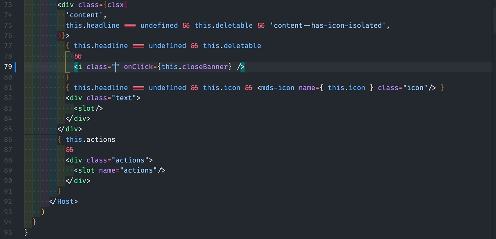

# Iconsauce Autocomplete

Iconsauce Autocomplete add support completion for [Iconsauce](https://iconsauce.github.io/docs/).

## Installation

**[Install via the Visual Studio Code Marketplace →](https://marketplace.visualstudio.com/items?itemName=iconsauce.vscode-iconsauce-autocomplete)**

In order for the extension to activate you must have Iconsauce installed and a Iconsauce config file named `iconsauce.config.js` in your workspace.

## Autocomplete

Intelligent suggestion for icon selectors.

